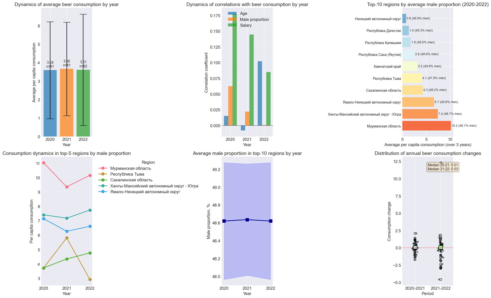
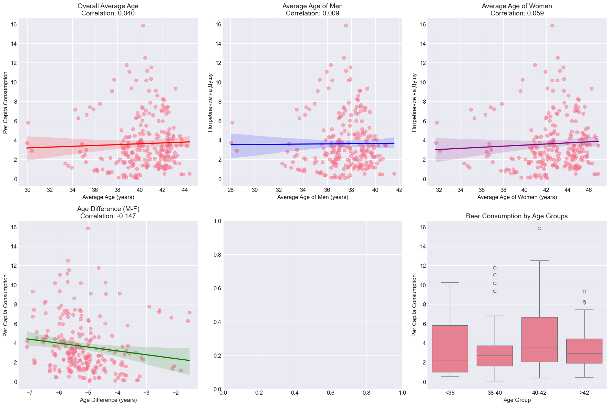
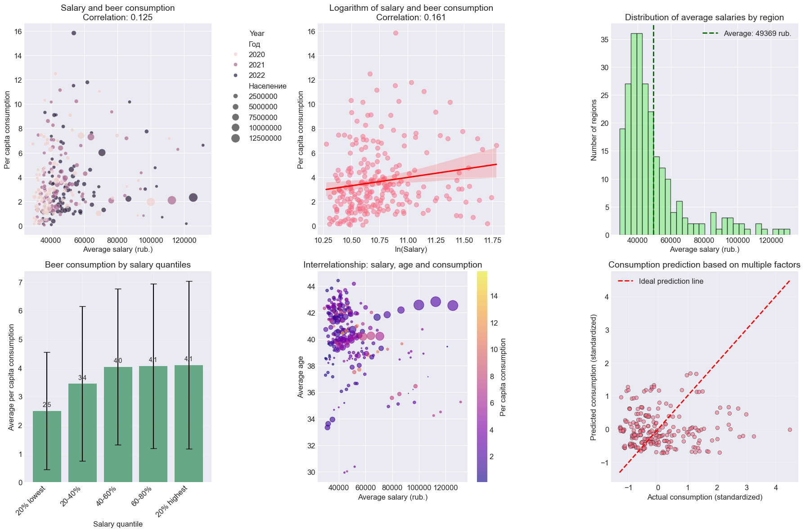

# A-study-of-factors-influencing-regional-beer-consumption-in-Russia-2020-2022-

Here you can find a project to quantitatively assess factors influencing beer consumption in Russian regions.

## How to start?

Download Dataset (Data_v01.xlsx) and Code (Code.ipynb). Then run Code.ipynb.

## Screenshots

